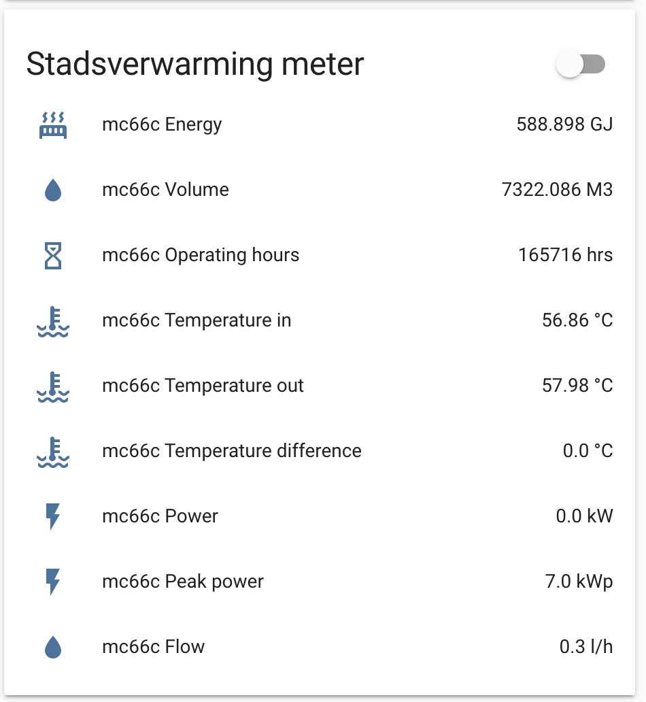

# Intro
This is a custom component for Home Assistant to get the readings from a Kamstrup Multical 66C meter.



According to the docs ([attached](5511-%20634%20GB%20Rev%20C1.qxd.pdf)) this might also work on the 66D and 66E versions. I was not able to test this, in case you've got one of these meters and want to give it a try, I would like to hear back from you.
For more technical details about the communication with the meter, you might want to check out pages 33-36. I also found page 9 with the units interesting.

# Requirements
To use this component, you'll need a cable with an IR read/write head and connect your machine running Home Assistant directly to the IR sensor of the Kamstrup Multical 66C meter.
For me, this USB-cable from [Ebay](https://www.ebay.nl/itm/USB-IR-Infrarot-Lese-Schreibkopf-f%C3%BCr-Stromz%C3%A4hler-Smart-Meter/274095213723) worked perfectly. The one from [Volkszaehler.org](https://wiki.volkszaehler.org/hardware/controllers/ir-schreib-lesekopf) seems also to work fine, but might be harder to get.

# Installation
There are a few ways you can install this custom component into your Home Assistant.
A solution I quite often see, is to manually copy all the files from [custom_components/mc66c/](custom_components/mc66c/) folder to your `<home-assistant_path>/config/custom_components/mc66c/`

A better way would be to check out this git repository in your Home Assistant.
eg. into a folder called `external`. So `<home-assistant_path>/config/external` and then create a symbolic link for the custom component:
```bash
cd <home-assistant_path>/config/custom_components
ln -s ../external/Home-Assistant-Sensor-MC66C/custom_components/mc66c mc66c
```
Doing this allows you to update the files easily from this repo.
```bash
cd <homeassistant_path>/external/Home-Assistant-Sensor-MC66C
git pull
```

# Configuration
Also, there are many ways to add this sensor to your configuration. You can add the bellow `sensor` and (optional) `group` from the example below directly to your `configuration.yaml` file.
The way I prefer doing this is making use of the [packages](https://www.home-assistant.io/docs/configuration/packages/) approach.
In that case you could use the following configuration in `<homeassistant_path>/packages/stadsverwarming.yaml`
```yaml
sensor:
  - platform: mc66c
    port: '/dev/ttyUSB1'
    scan_interval: 30
    resources:
      - energy
      - volume
      - op_hrs
      - temperature_in
      - temperature_out
      - temperature_diff
      - power
      - flow
      - peak_power

group:
  mc66c:
    name: Stadsverwarming meter
    entities:
      - sensor.mc66c_energy
      - sensor.mc66c_volume
      - sensor.mc66c_operating_hours
      - sensor.mc66c_temperature_in
      - sensor.mc66c_temperature_out
      - sensor.mc66c_temperature_difference
      - sensor.mc66c_power
      - sensor.mc66c_peak_power
      - sensor.mc66c_flow
```
## Configuration variables
This component has the following configuration variables:
```yaml
platform: mc66c
```
 This is required, to use this platform for the sensor. You can't change this.

```yaml
port: '/dev/ttyUSB1'
```
This is required, the port that has the IR cable, note if you use docker, that you have to expose this device to the container.

```yaml
scan_interval: 30
```
This is optional, the seconds that the sensor will check for updates, 30 is the default.

```yaml
resources: list
```
 This is optional, however an empty list (the default) will result in no sensors being created. Only the sensors that are being listed will be created. Possible values are:
 `energy` - Energy usage in `GJ`
 `volume` - Volume in `M3`
 `op_hrs` - Operating hours, using unit `hrs`
 `temperature_in` - Temperature in, in `°C`
 `temperature_out` - Temperature out in `°C`
 `temperature_diff` - difference in temperatures in `°C`
 `power` - Power usage in `kW`
 `peak_power` - Peak power in `kWp`

# Feedback
If you're facing any issues or have feedback or a request, feel free to raise an issue and I'll see what I can do. I've to admit I'm not very familiar with `python`, however, I'll try my best to make this component work for everyone. I'm also happy to accept any PR with fixes/improvements.

# Thank you!
[Jurgen](https://tweakers.net/gallery/92058/) on Tweakers, [pointing out the cable](https://gathering.tweakers.net/forum/list_message/62338462#62338462) needed for this to project to work.

[@RuntimeError123](https://github.com/RuntimeError123) for his [integration using MQTT](https://github.com/RuntimeError123/hass-mc66c), it helped me a lot setting up this custom component. If you're looking for a solution where the cable and Home Assistant are not running on the same machine, I recommend using his implementation.
